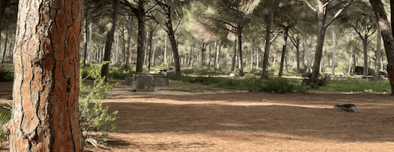

Docusaurus blogging featureocusaurus/plugin-content-blog

Example of adding an image:

Simply add Markdown files (or folders) to the `blog` directory.

Regular blog authors can be added to `authors.yml`.

The blog post date can be extracted from filenames, such as:
